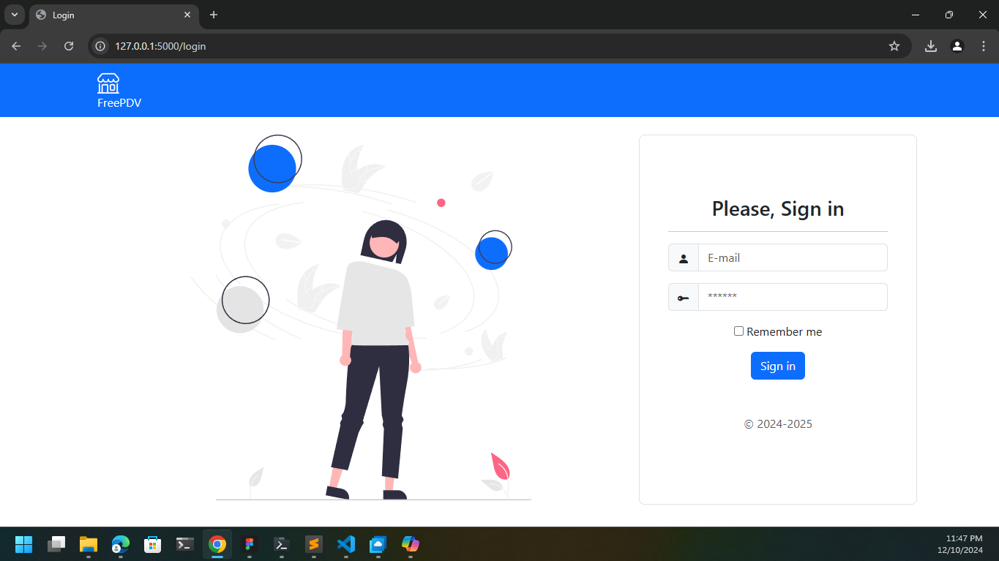

# FreePDV

**FreePDV** é uma solução de código aberto para automação de pontos de venda (PDV). O sistema foi desenvolvido para atender pequenas e médias empresas, oferecendo funcionalidades essenciais para gerenciamento de vendas, controle de estoque, emissão de recibos e relatórios de desempenho.

---

## 🎯 **Objetivo**
Fornecer uma ferramenta simples e gratuita, eficiente e customizável para comerciantes que buscam automatizar suas operações de venda sem depender de soluções pagas.

---

## 🚀 **Funcionalidades**
- Registro rápido de vendas.
- Calculo de venda e troco automático.
- Controle de estoque com alertas de reposição.
- Geração e impressão de recibos.
- Relatórios detalhados de vendas e produtos.
- Suporte a múltiplos usuários com permissões personalizadas.
- Integração com dispositivos como leitores de código de barras e impressoras fiscais.

---

## 🛠️ **Tecnologias Utilizadas**
- **Frontend**: Bootstrap 5.
- **Backend**: Python & Flask.
- **Banco de Dados**: PostgreSQL.
- **Outras Ferramentas**: Grafana, Docker.

---

## 📦 **Como Instalar**
1. Clone o repositório:
    ```powershell
    git clone https://github.com/seu-usuario/FreePDV.git
    ```
2. Realize a instalação do python as dependencias em sua maquina.
    ```powershell
    winget install python && python -m pip install requiriments_dev.txt
    ```
3. Crie os arquivos .env e toml para configurar as variáveis de ambiente e configurações do projeto.
    #### .env file
    ```text
    FLASK_ENV=development 
    FLASK_APP=openpdv/app.py
    FLASK_DEBUG=true
    ```

    #### .toml file:
    ```text
    [development]
    DEBUG = true
    FLASK_ADMIN_NAME = "FreePDV"
    FLASK_ADMIN_SWATCH = "cerulean"
    SQLALCHEMY_DATABASE_URI = "sqlite:///development.db"
    TITLE = "FreePDV"
    PASSWORD_SCHEMES = ["pbkdf2_sha512", "md5_crypt"]
    ```
4. Por fim, podemos iniciar o projeto para acessar seus recursos.
    ```powershell
    flask run
    ```

    Acessivel por padrão em **http://127.0.0.1:5000** ou **http://localhost:5000**.

---
## 💻 **Interface**
**Login**



---
## ☕ **Pague-me um Café**
Se este projeto foi útil para você e você gostaria de apoiar o desenvolvimento contínuo, considere pagar-me um café! Sua contribuição ajuda a manter o projeto atualizado e melhora ainda mais as funcionalidades. 🥳
- **Wallet**: 0x0dF5920055D620D12B1bD5cb4E367d38c5057713
- **Pix**: bcb7a95d-c3f9-4b0a-aa86-a68706e26281
- [**Buy Me a Coffee**](https://www.buymeacoffee.com/resu94xsrc)

Obrigado por seu apoio! 💖
